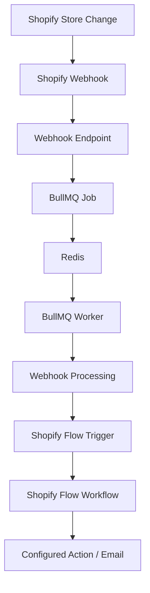

# Shopify Webhook & Background Processing Flow

A simple, high-level overview of how webhooks move from Shopify through our application, BullMQ, Redis, and into Shopify Flow.

---

## 1. How It Works at a Glance

When something changes in your Shopify store (such as a new order, an updated product, or a modified customer), Shopify notifies our application, which processes the event in the background and triggers your configured Shopify Flow.



---

## 2. Core Concepts Explained Simply

### 1. Shopify Webhook
* **What happens**: A change occurs in the Shopify store (e.g., an order is created or updated).
* **Notification**: Shopify detects the event and immediately sends an HTTP request (the webhook) to our application's webhook endpoint.
* **Fast Hand-off**: Our endpoint receives and validates the webhook, passes it directly into the background queue, and returns an HTTP `200 OK` response right away.
* **Why**: Shopify requires webhooks to be acknowledged quickly. By handing off the work to the queue, the request finishes in milliseconds without waiting for heavy processing.

### 2. BullMQ
* **What it is**: The background job and queue manager.
* **What it does**: Instead of processing the webhook inside the short-lived HTTP request, BullMQ creates an asynchronous background job for each incoming webhook.
* **Why we use it**: It decouples receiving webhooks from processing them. If multiple webhooks arrive at the same time, BullMQ manages the workload so jobs can be processed independently and concurrently by worker threads.

### 3. Redis
* **What it is**: The fast, in-memory data store used by BullMQ.
* **Relationship**:
  ```text
  Webhook  ──>  BullMQ  ──>  Redis (storage)  ──>  BullMQ Worker
  ```
* **Role**: Redis does **not** process webhooks itself. It acts as the high-speed storage engine that BullMQ relies on to hold the queue, manage job state, and coordinate workers.

### 4. Shopify Flow
* **What it is**: Shopify's automation tool for stores.
* **Flow is not the webhook**:
  * The **webhook** is Shopify telling our app that an event occurred.
  * Our **worker** processes that event and then fires our custom **Shopify Flow Trigger**.
  * **Shopify Flow** then runs the store's visual workflow (e.g., sending an email notification, logging details, or applying tags).

---

## 3. Simple End-to-End Example

```text
A customer, order, or product changes in Shopify
            ↓
Shopify sends a webhook to our app
            ↓
Our webhook endpoint receives it and returns 200 OK
            ↓
A BullMQ job is placed onto the queue
            ↓
Redis safely stores the queue data
            ↓
The BullMQ worker picks up the job in the background
            ↓
The webhook data is processed
            ↓
Our app triggers Shopify Flow
            ↓
The configured Shopify Flow workflow runs its action (e.g., Send Email)
```

---

## 4. Component Comparison

| Component | What it does |
| :--- | :--- |
| **Shopify Webhook** | Tells our application that something changed in Shopify |
| **BullMQ** | Creates and manages background webhook jobs |
| **Redis** | Provides the storage and backend queue engine used by BullMQ |
| **BullMQ Worker** | Picks up jobs from the queue and executes the processing logic |
| **Shopify Flow** | Runs the merchant's configured automation workflow after being triggered |

---

## 5. Running Locally

### 1. Check Redis
Ensure Redis is running locally on port 6379:
```bash
redis-cli ping
```
*Expected output:*
```text
PONG
```

### 2. Start the Application
In your first terminal, start the Shopify app dev server:
```bash
npm run dev
```

### 3. Start the Background Worker
In your second terminal, start the BullMQ worker process:
```bash
npm run worker
```
# Flow-email-notification
